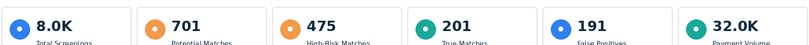
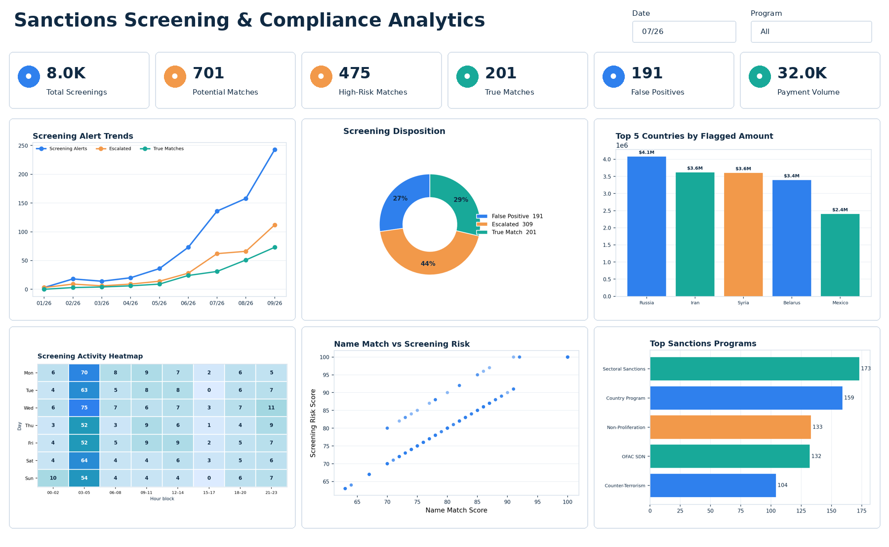
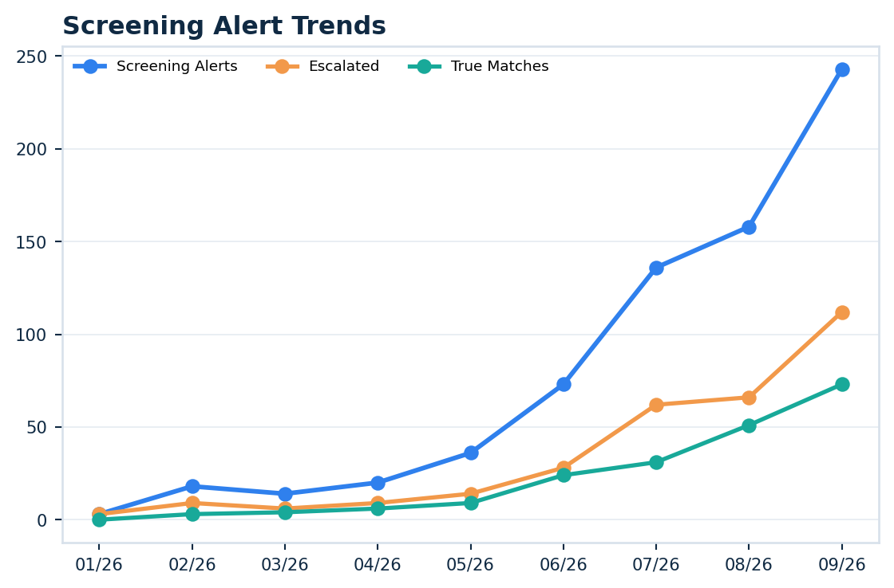
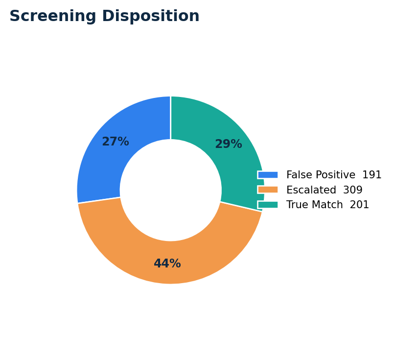
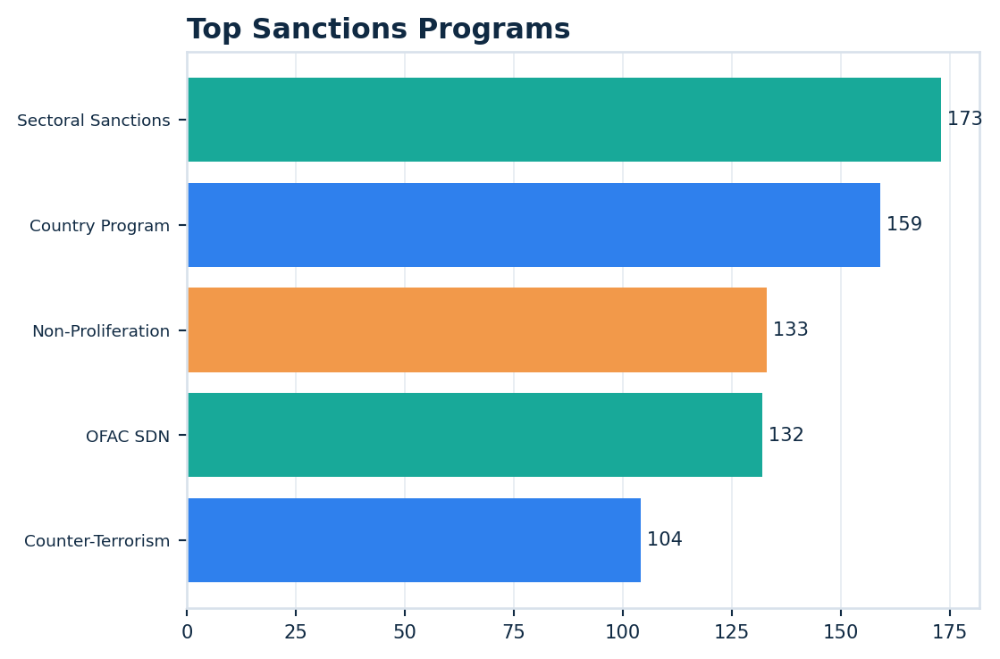

# Sanctions Screening & Compliance Analytics

A complete synthetic sanctions-compliance portfolio project built to the same presentation standard as Project 3.

## Scale
- 2,000 customers
- 8,000 counterparties
- 32,000 payments
- 180 synthetic watchlist records
- 701 potential sanctions-screening alerts

## Workflow
Counterparty / customer screening → name and alias matching → identifier/country comparison → risk scoring → false positive / escalation / true-match disposition → payment review → portfolio monitoring.

## Technical Stack
SQL, Python, Tableau, Streamlit.

## Dashboard
Six KPI cards and exactly six visualizations:
1. Screening Alert Trends
2. Screening Disposition donut
3. Top 5 Countries by Flagged Amount
4. Screening Activity Heatmap with numbers
5. Name Match vs Screening Risk scatter
6. Top Sanctions Programs

Dates use MM/YY such as 07/26. No stacked bars.

## Dashboard Preview

The visuals below come directly from the executive dashboard and summarize the project's main sanctions-screening and compliance findings.

### KPI Scorecard

**What it represents:** Summarizes total screenings, potential matches, high-risk matches, true matches, false positives, and payment volume.

### Executive Dashboard

**What it represents:** Combines screening trends, alert dispositions, geographic exposure, screening activity, match risk, and sanctions-program activity in one compliance view.

### Screening Alert Trends

**What it represents:** Tracks screening alerts, escalations, and true matches over time to show changes in sanctions-screening activity and outcomes.

### Screening Disposition

**What it represents:** Shows how potential sanctions matches are resolved across false positives, escalations, and true matches.

### Top Sanctions Programs

**What it represents:** Highlights the sanctions programs generating the highest screening activity and helps identify where compliance review is concentrated.

## Resume Bullets
**Sanctions Screening & Compliance Analytics | SQL, Python, Tableau, Streamlit**
- Built an end-to-end sanctions-screening analytics project across 8,000 synthetic counterparties and 32,000 payments, using explainable name/alias similarity and geographic identifiers to prioritize potential sanctions matches.
- Developed SQL investigation queries, Python screening and risk-scoring logic, Tableau executive monitoring, and a Streamlit analyst workbench for false-positive resolution, escalation, true-match review, and payment exposure analysis.

## Interview Explanation
“I built a sanctions compliance analytics project that simulates screening counterparties against a synthetic sanctions watchlist. The workflow combines name and alias similarity with country and payment context to prioritize alerts. I used SQL for investigation queries, Python for explainable matching and risk scoring, Tableau for executive monitoring, and Streamlit for an analyst-style screening and payment review workflow.”

## Disclaimer
All customers, counterparties, names, watchlist records and transactions in this project are synthetic and created for educational portfolio use.

## Final Dashboard Color & Heatmap Standard
The final dashboard uses only three visualization colors: blue, teal, and orange.

The screening heatmap was redesigned for clarity. It uses 7 weekday rows and 8 three-hour time blocks rather than 24 cramped hourly columns, with the alert count centered inside every cell.

## Separate KPI Visualization
A standalone KPI scorecard is included at `images/01_kpi_scorecard.png`.

It contains the six executive KPIs separately from the six main dashboard visualizations, making the project easier to present in Tableau, Streamlit, GitHub, or interviews.
